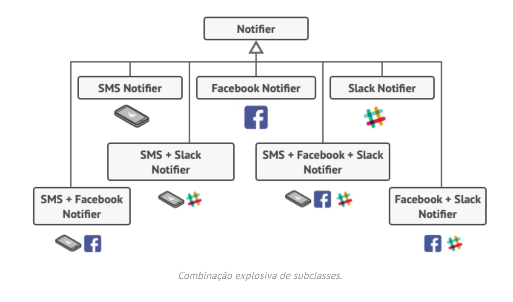
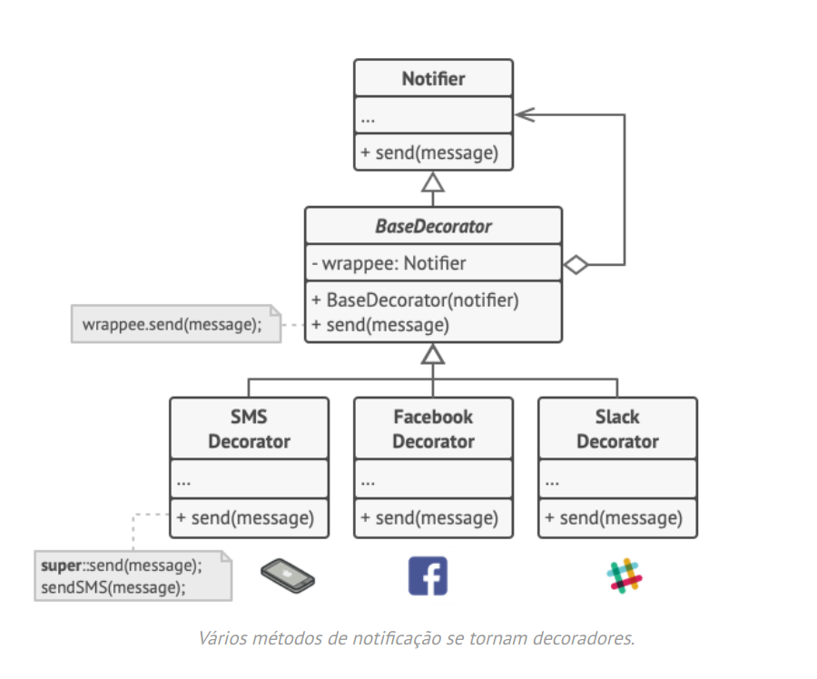

# Decorator pattern implementation
## _C# decorator project POC and unity test_

Decorator is a structural design pattern that lets you attach new behaviors to objects by placing these objects inside special wrapper objects that contain the behaviors.

Extending a class is the first thing that comes to mind when you need to alter an object’s behavior. However, inheritance has several serious caveats that you need to be aware of.

# Problem


Inheritance is static. You can’t alter the behavior of an existing object at runtime. You can only replace the whole object with another one that’s created from a different subclass.
Subclasses can have just one parent class. In most languages, inheritance doesn’t let a class inherit behaviors of multiple classes at the same time.
One of the ways to overcome these caveats is by using Aggregation or Composition  instead of Inheritance. Both of the alternatives work almost the same way: one object has a reference to another and delegates it some work, whereas with inheritance, the object itself is able to do that work, inheriting the behavior from its superclass.

# Solution


With this new approach you can easily substitute the linked “helper” object with another, changing the behavior of the container at runtime. An object can use the behavior of various classes, having references to multiple objects and delegating them all kinds of work. Aggregation/composition is the key principle behind many design patterns, including Decorator. On that note, let’s return to the pattern discussion.

“Wrapper” is the alternative nickname for the Decorator pattern that clearly expresses the main idea of the pattern. A wrapper is an object that can be linked with some target object. The wrapper contains the same set of methods as the target and delegates to it all requests it receives. However, the wrapper may alter the result by doing something either before or after it passes the request to the target.

When does a simple wrapper become the real decorator? As I mentioned, the wrapper implements the same interface as the wrapped object. That’s why from the client’s perspective these objects are identical. Make the wrapper’s reference field accept any object that follows that interface. This will let you cover an object in multiple wrappers, adding the combined behavior of all the wrappers to it.

# Run the project
Just execute this command inside Decorator project folder.
```sh
dotnet run
```

Run this one in root path of repository to run unit tests.

```sh
dotnet test
```